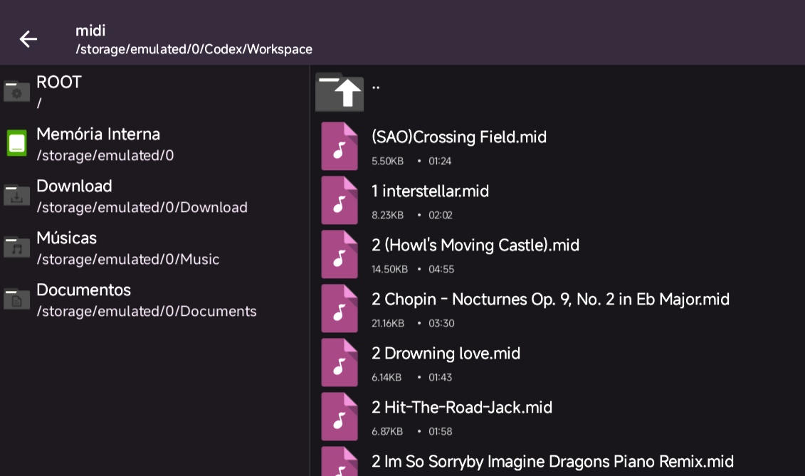

# MidiPlayer

Virtual Piano Player para o Roblox

## instalação 

Para usar é bem simples, só executar este loadstring no seu executor :)

(loadstring)

## Forma de uso

Para poder dar Play no seus Midifiles, você tem que adicionar eles a pasta "Workspace/midi/" dentro de algum gerenciador de arquivos genérico.

Eles vão ficar acessível no GUi

https://user-images.githubusercontent.com/74037129/121129781-4ccd6e80-c7e2-11eb-8a59-561aebb2cf8b.mp4

Para selecionar as músicas de dois cliques na música

O botão circular que esta do lado do título é para ativar/desativar a visualização das notas, recomendo deixar desativado caso esteja no celular, ele causa lag
